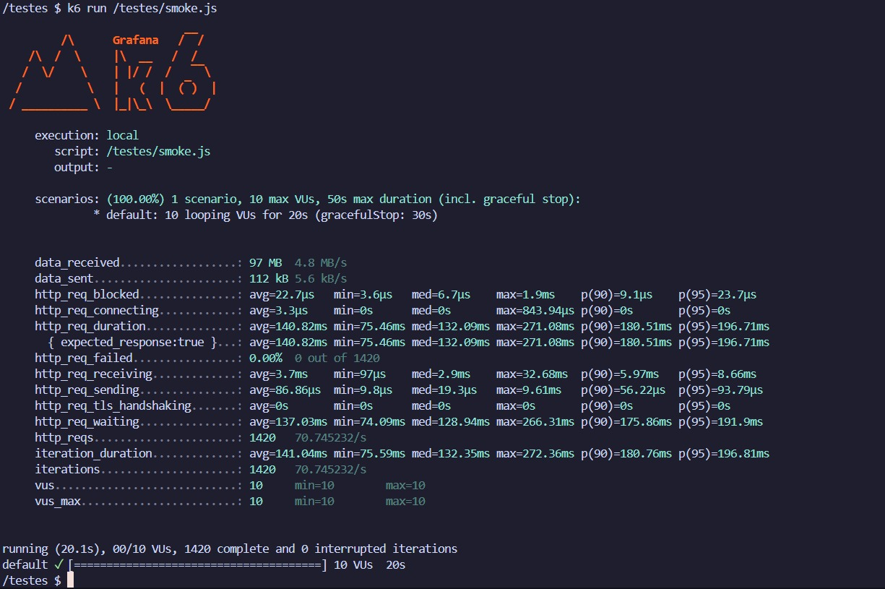
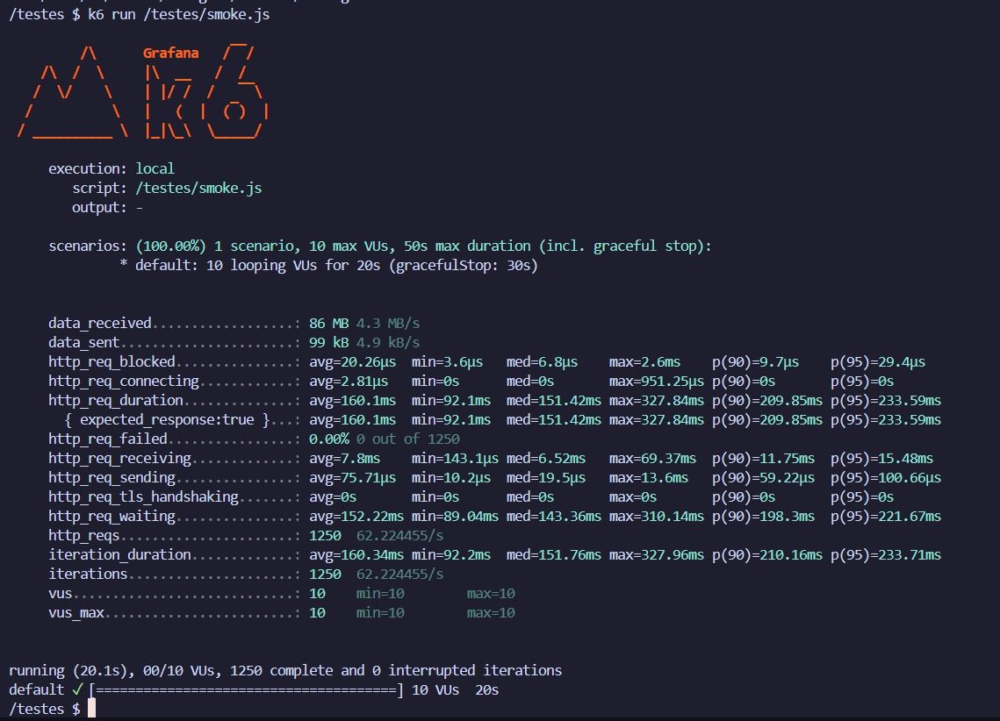
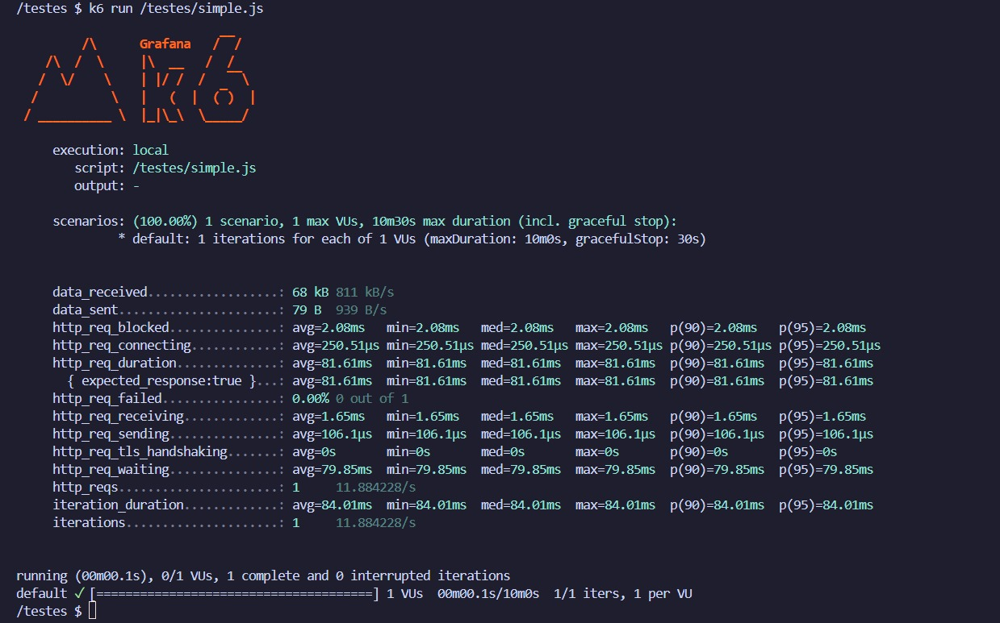
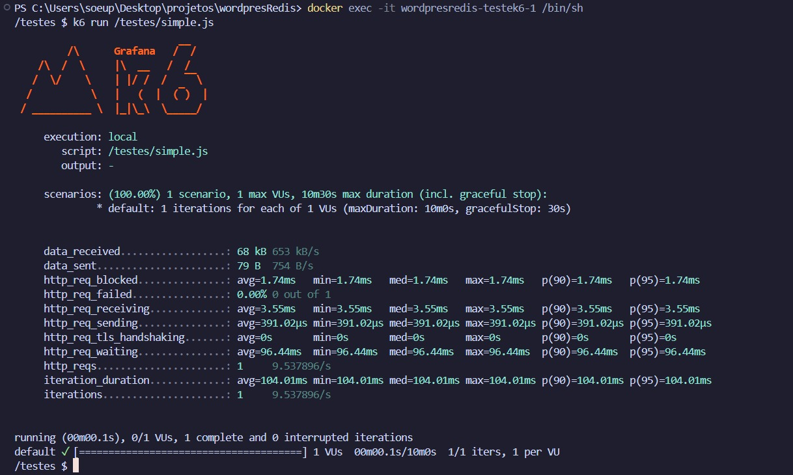
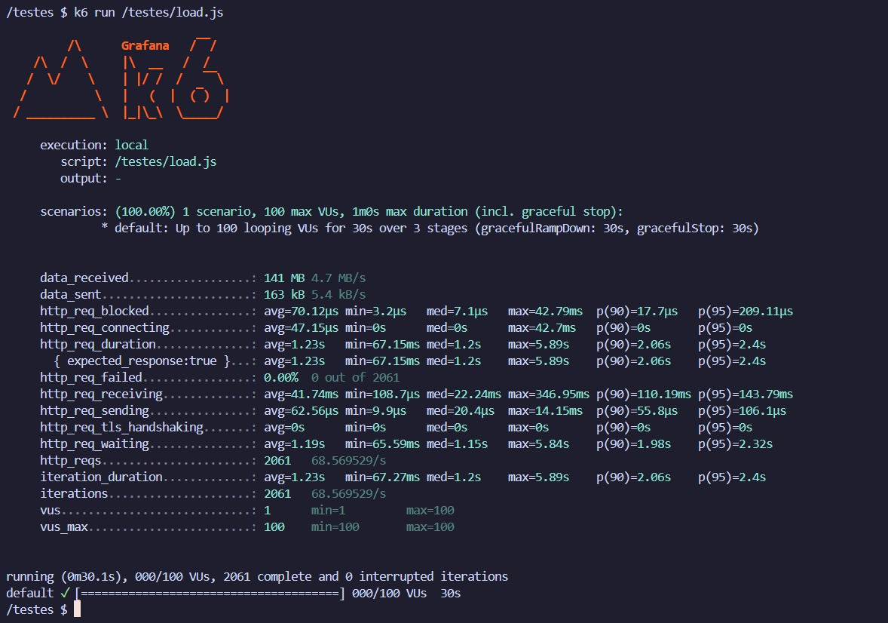
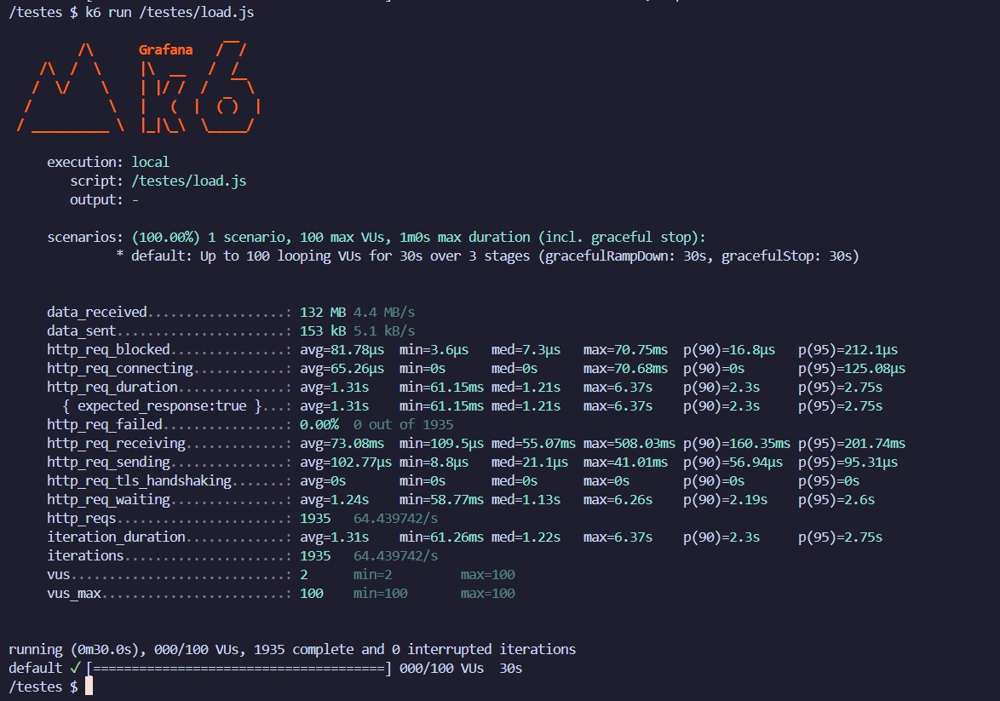

---

# Testes de Performance com K6 e Redis no WordPress  

Este documento apresenta os resultados dos testes de desempenho realizados na API do WordPress utilizando o **K6**. Os testes foram feitos comparando o desempenho **com e sem o Redis Object Cache**, um plugin que melhora a performance ao reduzir consultas ao banco de dados.  

## 📌 Testes Realizados  

Foram realizados **seis testes** divididos da seguinte forma:  

- **Sem Redis**  
  1. Smoke Test  
  2. Simple Test  
  3. Load Test  

- **Com Redis**  
  4. Smoke Test  
  5. Simple Test  
  6. Load Test  

## ⚙️ Configuração do Ambiente  

O ambiente de testes foi configurado utilizando **Docker Compose**, garantindo consistência na execução. O `docker-compose.yml` define os seguintes serviços:  

- **WordPress**: Configurado para rodar em `http://localhost:8080`, conectado ao banco de dados MySQL.  
- **MySQL**: Banco de dados MySQL 8.0 com credenciais pré-definidas.  
- **Redis**: Container do Redis rodando na porta `6379`, usado como cache para otimizar as requisições.  
- **K6**: Serviço para rodar os testes de carga, configurado no container `testek6`.  

### 📄 Arquivo `docker-compose.yml`

```yaml
version: '3.8'

services:
  redis:
    image: 'redis:alpine'
    ports:
      - '6379:6379'
    restart: always
    expose:
      - '6379'

  wordpress:
    image: wordpress
    restart: always
    ports:
      - 8080:80
    environment:
      WORDPRESS_DB_HOST: db
      WORDPRESS_DB_USER: exampleuser
      WORDPRESS_DB_PASSWORD: examplepass
      WORDPRESS_DB_NAME: exampledb
      WORDPRESS_CONFIG_EXTRA: |
        define('WP_HOME', 'http://localhost:8080');
        define('WP_SITEURL', 'http://localhost:8080');
    volumes:
      - wordpress:/var/www/html

  db:
    image: mysql:8.0
    restart: always
    environment:
      MYSQL_DATABASE: exampledb
      MYSQL_USER: exampleuser
      MYSQL_PASSWORD: examplepass
      MYSQL_RANDOM_ROOT_PASSWORD: '1'
    volumes:
      - db:/var/lib/mysql

  testek6:
    build:
      context: .
      dockerfile: Dockerfile
    depends_on:
      - wordpress
    volumes:
      - ./testes:/testes
    stdin_open: true
    tty: true
    entrypoint: ["/bin/sh", "-c", "tail -f /dev/null"]

volumes:
  wordpress:
  db:
```

## 📊 Resultados  

### 🔹 Smoke Test  

#### Sem Redis  
  

- **http_req_duration** (Duração média das requisições):  _XX.XXms_  
- **p(95)** (Percentil 95): _XX.XXms_
- **http_req_failed** (Requisições falhas):   _XX.XXms_ 
- **http_reqs** (Total de requisições):   _XX.XXms_

#### Com Redis  
  

- **http_req_duration** (Duração média das requisições): _XX.XXms_  
- **p(95)** (Percentil 95): _XX.XXms_  
- **http_req_failed** (Requisições falhas): _X.XX%_  
- **http_reqs** (Total de requisições): _XXXX_  

### 🔹 Simple Test  

#### Sem Redis  
  

- **http_req_duration** (Duração média das requisições): _XX.XXms_  
- **p(95)** (Percentil 95): _XX.XXms_  
- **http_req_failed** (Requisições falhas): _X.XX%_  
- **http_reqs** (Total de requisições): _XXXX_  

#### Com Redis  
  

- **http_req_duration** (Duração média das requisições): _XX.XXms_  
- **p(95)** (Percentil 95): _XX.XXms_  
- **http_req_failed** (Requisições falhas): _X.XX%_  
- **http_reqs** (Total de requisições): _XXXX_  

### 🔹 Load Test  

#### Sem Redis  
  

- **http_req_duration** (Duração média das requisições): _XX.XXms_  
- **p(95)** (Percentil 95): _XX.XXms_  
- **http_req_failed** (Requisições falhas): _X.XX%_  
- **http_reqs** (Total de requisições): _XXXX_  

#### Com Redis  
  

- **http_req_duration** (Duração média das requisições): _XX.XXms_  
- **p(95)** (Percentil 95): _XX.XXms_  
- **http_req_failed** (Requisições falhas): _X.XX%_  
- **http_reqs** (Total de requisições): _XXXX_  

## 🏆 Conclusão  

Os testes mostraram que a ativação do **Redis Object Cache** resultou em **melhor desempenho** nas requisições, com **tempos de resposta reduzidos** e maior eficiência no uso do banco de dados. 🚀  
